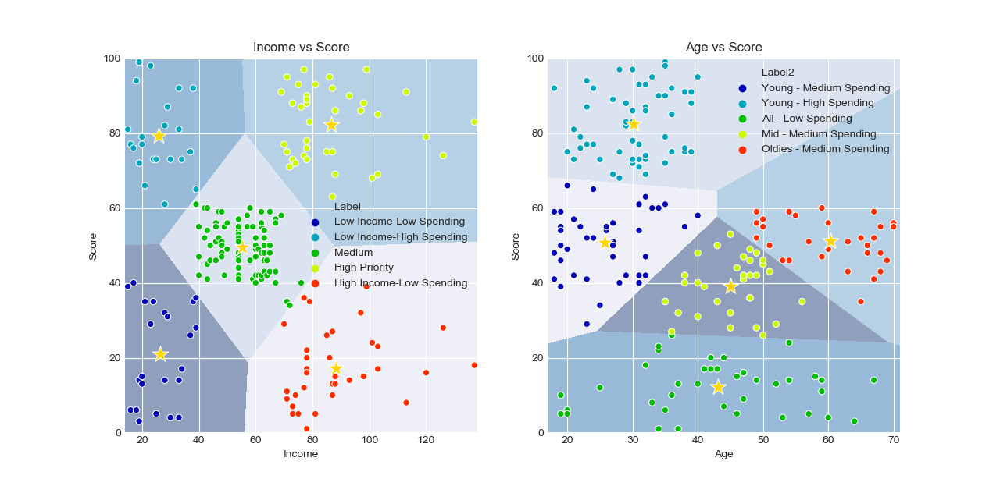

# Mall Customers Clustering

Simple customer segmentation project using machine learning algorithm (KMeans Clustering) to understand the customers (target customers) who can be easily converge so that the sense can be given to marketing team and plan the strategy accordingly. 

Dataset source: https://www.kaggle.com/vjchoudhary7/customer-segmentation-tutorial-in-python

 